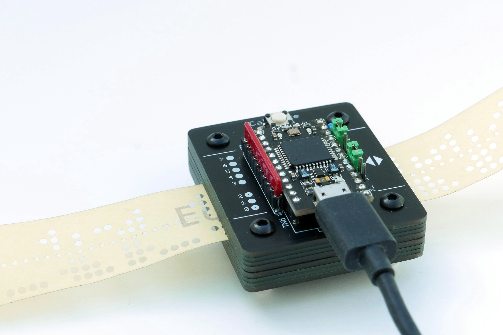
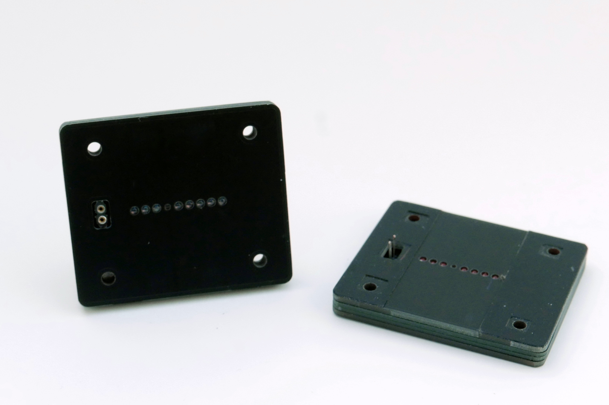
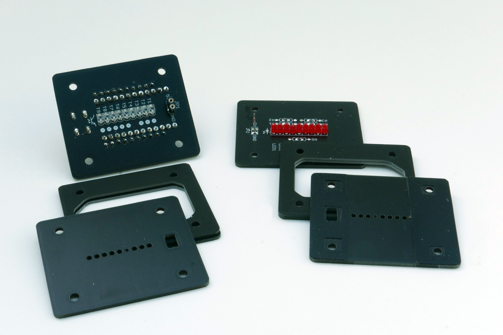
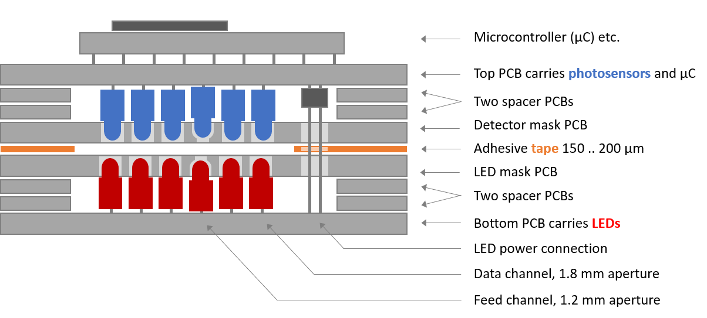

# Paper Tape Reader

**Repository:** [github.com/Supermagnum/paper-tape](https://github.com/Supermagnum/paper-tape)

<a href="https://www.pcbway.com/project/shareproject/paper_tape_reade_0e895082.html"></a>

Design and documentation by [Jürgen Müller / e-basteln](https://e-basteln.de/computing/papertape/overview/). This repository contains the firmware, PCB design files, and manufacturing data for the manual optical paper tape reader described on the [e-basteln Paper Tape Reader pages](https://e-basteln.de/computing/papertape/overview/).

PCB files converted to Kicad, I have merged the 4 spacers into the main pcb file.

Use 1.6mm thick PCB board.
Spacers originally used  1.2 mm thick PCB.

## Overview

This little manual paper tape reader is easy to build and operate. It connects to any modern computer via USB, and performs well with all kinds of 5 to 8 bit paper tape, including translucent paper materials. To compensate for sensor tolerances and adjust to different paper types, it can automatically calibrate its optical sensors.



The paper tape reader is controlled by an Arduino Pro Micro. Punched holes are detected optically, via analog inputs to the Arduino and automatic thresholding in software.

Optical readers for punched paper tape have been used since the 1940s; the one developed in 1942 for the British Heath Robinson deciphering machine was probably among the earliest. Non-motorized optical readers, where the tape is pulled through by hand, became popular with early computer amateurs in the 1970s. Oliver Audio Engineering launched the OP80A as a kit or complete unit in 1976; a replica is still commercially available today. And to this day, amateurs interested in the old paper tape format occasionally build their own optical readers.

Operate the reader handheld or mounted to a base plate. Tape is pulled through manually, at up to 1 meter/second feed rate.



The two main modules are the phototransistor detector (left) and the LED illuminator (right). The Arduino sits on top of the detector module. Only two power connections go to the illuminator.



All chassis parts are made from PCB material: Circuit boards for phototransistors and LEDs, masks to precisely define the illumination and detection apertures, and light-tight spacers.

## Using the Reader

To use the paper tape reader, simply connect it to a Windows 10, Linux or Mac OS computer via USB. The reader should automatically register as a USB CDC device (communication device class, a virtual serial port).

Start a terminal program of your choice and select the right (virtual) serial port. No need to set the baud rate etc., since no physical serial port is involved. The reader will start sending data as soon as you pull paper tape through.

Before the first operation, or when switching to a new type of paper tape with very different transparency, calibrate the reader as described below.

## LEDs

Two LEDs on the Pro Micro board are used to signal the operating status. They are labelled on the detector PCB:

- **FEED** flashes once for every valid feed hole detected during operation and calibration.
- **CAL** indicates that calibration mode is active, or that a calibration is recommended.

| CAL indication | Meaning |
|----------------|---------|
| Steady ON | Calibration mode is active |
| Flashing, 1 Hz | Waiting for user to start calibration (press CAL button), or for 10 s timeout |
| Flashing, 10 Hz | Error during the calibration process |
| ON in read mode | Invalid brightness levels have been read (no clear high or low). Recalibration is recommended. |

## Calibration

1. Press **CAL** once to view the current calibration. Current calibration values are printed via USB, the CAL LED blinks at 1 Hz.
2. Press **CAL** again within 10 seconds to enter calibration mode. You will be prompted via a USB message to start feeding tape, the CAL LED turns on.
3. Feed tape, beginning within 10 seconds. Approximately 30 cm of sample tape are required. Ideally all data bits should be exercised in the sample, but if no significant contrast is detected for a data channel, averaged thresholds from the other channels will be used. The CAL LED stays on, the FEED LED begins to flash when valid feed holes are seen.
4. Calibration automatically ends when enough sample tape has been processed, or when one of the 10 second timeouts mentioned above is reached. Results and final status are printed via USB; errors are also signaled by rapid flashing of the CAL LED for 1 second. The CAL LED is then switched off.

## Jumpers

Three different tape widths can be set via jumpers. Setting them properly is recommended to avoid "CAL" indications from invalid detection levels at the tape edges, and to mask invalid bits from the output bytes.

| Tape width | Tape/bit placement | Jumper settings |
|------------|-------------------|-----------------|
| 8 bit | 76543.210 | 5BIT=open, TST=open |
| 7 bit | - 6543.210 | 5BIT=set, TST=set |
| 5 bit | - - 432.10 - | 5BIT=set, TST=open |

Note that the 7-bit setting is only required for the rather uncommon type of paper tape which is physically only seven rows wide. For this narrower tape, the 7-bit setting masks out any invalid readings from the eighth detector (which looks just at the tape edge). The common 1" wide tape can be read in the 8-bit setting, no matter whether seven or eight rows of holes are actually punched on it.

Setting only the **TST** jumper will activate test mode, where the raw ADC readings from all 9 channels are printed on the output in an endless loop. From left to right, bits 0 to 7 are displayed, followed by the feedhole signal on the far right. A high value, up to 255, indicates high brightness.

The **INV** jumper will set the reader to use inverted intensity thresholds, i.e. a logical '1' or an active feed track pulse are signaled by a dark light level. This is useful for reading paper tapes which have not been punched, but printed on thin paper, for demonstrations or tests where real paper tape and a punch device are not available. Since the light levels will be lower in this case, it is recommended to replace the resistor array RN1 by a 22 kOhm array.

**TX** is not a jumper, but a serial output. This can optionally be used to connect legacy equipment. Please see the Serial Output section below for details.

## Serial Output

Normally, the USB port is used to interface the tape reader to a modern computer. If you want to read paper tapes into a vintage computer without a USB port, you can use the TX pin on the jumper row which sends "real" serial data.

- All data read from paper tape will be transmitted as an asynchronous serial data stream: 9600 baud, 8 data bits, no parity, 1 stop bit. Voltage levels are positive: A logical '1' (which is also present at rest) is represented by +5 V, a logical '0' (which is also the start bit of each character) by 0 V.
- The baud rate can only be changed by editing the Arduino source code. Look for the `SERIAL_INIT()` call; this is a macro which goes back to `Serial1.begin()` and accepts the baud rate as a parameter.
- To connect to computers with classic RS-232 ports, an external level converter to +/-5 V .. +/-12 V is needed. These are available off-the-shelf or as a kit. They also invert the signal polarity, making logical '1' a negative voltage as defined in the RS-232 standard.
- To provide 5 V power to the level converter, you can omit capacitor C1 and install two more posts (pins) in that position. The outermost pin has +5 V, the next one is another GND pin (see the pin table below). You can also power the paper tape reader via this pin if you do not want to use the USB port.
- Neither calibration data and prompts nor the raw ADC readings in TST mode will be transmitted via this output. This is deliberate; the idea is to use a modern PC to set up the reader, and not bother the vintage system with these setup data.

Summary of all pins on the jumper row and their functions:

| Pin | Function |
|-----|----------|
| +5 V | Power, e.g. for optional external RS-232 level converter |
| GND | Ground (0 V) |
| 5BIT | Jumper to GND: 5 bit or 7 bit tape width |
| GND | Ground (0 V) |
| INV | Jumper to GND: Use printed paper tape with dark 'holes' |
| GND | Ground (0 V) |
| TST | Jumper to GND: Test mode, transmit raw ADC readings via USB |
| GND | Ground (0 V) |
| TX | Serial output: TTL level, 9600 8N1 |
| GND | Ground (0 V) |

## Building the Reader

There are no step-by-step illustrated building instructions here. But with the sectional view of the PCB stack below and the following hints the build should be straightforward.



Sectional view of the stack of PCBs which make the chassis, as well as the key electronic components. For clarity, only 5 of the 8 data sensors and LEDs are shown.

### Builder's Hints

#### Sourcing the parts

- The design files for the custom circuit boards are provided in the Design Files section below. You can order the PCBs cheaply from vendors like JLCPCB, PCBWay, Aisler etc. by uploading the zipped Gerber files provided.
- While the microcontroller board is commonly called an "Arduino Pro Micro", and is fully compatible with the Arduino development tools, it was not designed by the Arduino company but by Sparkfun. You can purchase the original Sparkfun Pro Micro or one of various cheaper "Pro Micro" or "Arduino Pro Micro" clones available on ebay etc. In either case, be sure to buy the **5 V / 16 MHz** version! The variant operating at 3.3 V and 8 MHz is not suitable for this project.
- A Digikey shopping cart is available for most of the other parts. If you are based in Europe, Reichelt may be a lower-cost alternative supplier (see the bill of materials in the Design Files section below). The Digikey cart contains alternative values for the resistor array (2.7 kOhm or 10 kOhm), in case of major batch variations of the LEDs or photo-transistors. These may not be necessary. To my knowledge, all builds so far have successfully used the standard 4.7 kOhm array.

#### Preparing the PCBs

- The circuit boards and aperture boards for the detector and illumination are all made in one piece, to ensure that holes and milling contours align on all of them. (Probably an unnecessary precaution.) Hence you need to first break these boards apart, roughly clip off the tabs, and then sand the contours smooth. I recommend that you assemble the complete PCB package with screws according to the picture below and then sand it as a package to obtain even contours.
- Please note that the fibers in PCB dust may be harmful. Work outside or in an area where you can contain the dust, and wear a protective mask.

*The stack of PCBs that make the paper tape reader.*

- The aperture hole for the feed track is only 1.2 mm in diameter, matching the feed holes in the paper tape for maximum signal modulation. On both aperture PCBs this hole needs to be drilled out to 1.8 mm to accommodate the LED and phototransistor, as indicated in the silk screen print on the PCB. But do not drill all the way through; this must be drilled as a blind hole, preserving the 1.2 mm optical aperture! Use a drill press and/or much care to drill to the right depth.
- To create a gap for the paper tape between the two aperture PCBs, two strips of adhesive tape are placed on top of the LED aperture board. This also provides lateral guidance for the paper tape, so you have to decide on a tape width you want to read. (I intend to provide inserts to reduce from 8-bit tape to 7 or 5 bit width, but have not tried this yet.)
- Fix the aperture PCB to the work bench with a bit of adhesive tape, position a short piece of punched paper tape exactly over the apertures as a reference and attach it to the bench as well. Apply two strips of adhesive tape to the PCB, right next to the paper tape, as a spacer and guide. About 200 um should be a good thickness; you may need to stack two layers of electrical tape or similar to get there. With a sharp knife, trim the tape along the PCB contours and cut the holes for screws and power connector.
- To make it easier to introduce the paper tape into the narrow gap later, you can lightly sand the edges of the LED aperture PCB in the space between the two guide tapes. This creates a slight "funnel" for insertion of the paper tape.

*The pre-assembled modules: Phototransistor detector with apertures (left) and LED illuminator with apertures and spacer tape (right). Two sockets and wires provide power to the LEDs.*

#### Populating components

- To populate the LEDs, insert all 9 loosely into the PCB. (Note the correct orientation; the body outline is shown on the silkscreen print.) Put the two spacer PCBs and the aperture PCB on top, wiggle the LEDs into their respective aperture holes, and hold the PCB stack together with screws or adhesive tape. Push the LEDs all the way down into their holes. The feed hole LED will not go quite as far into its blind hole as the other LEDs. Then solder all LEDs.
- Do the same with the phototransistors.
- The LED series resistors (R1 to R5) can be populated as through-hole resistors inside the module. This requires resistors with a diameter less than 2.4 mm, the thickness of the two spacer PCBs. The diameters of through-hole resistors vary by manufacturer. If you cannot find suitably slim through-hole resistors, you can either mount them on the opposite side of the PCB, or you can populate 0603 or 0805 sized SMD resistors on the provided pads.

#### Populating sockets and pins

- For the 5V power connection to the illuminator module, solder a two pin socket to the bottom of the detector board. (Make sure to get it reasonably straight.) Insert two clipped wire ends into the sockets. Provisionally assemble the full PCB stack while guiding the wires through their pads in the illuminator board. Clip wires to length and solder them to the illuminator board.
- You can solder the Arduino Pro Micro permanently to the detector PCB with the square soldering pins provided with most Arduino boards. This will give the lowest-profile package. If that is what you prefer, make sure that the phototransistors and 5V supply socket are soldered before you place the Arduino! Alternatively, use two rows of 1x12 pin sockets for the Arduino. In that case, the standard square pins will not fit, and you need to obtain smaller (turned) pin headers to match the sockets.
- The resistor array RN1 (9 x 4.7 kOhm) can be soldered directly if you only want to read "real", punched paper tape. Be sure to check the orientation; the common pin must be oriented towards the USB jack. If you want to use printed tape in the future, i.e. black dots on translucent paper, you may need to exchange RN1 for a 22 kOhm or 33 kOhm array to give higher light sensitivity. In that case, use a 1x10 pin socket for RN1.

*I opted for sockets for the resistor array (so I can try different values) and the Arduino (in case I need to get to the soldering joints beneath it).*

#### Programming the Pro Micro

- The Pro Micro processor is programmed via the regular Arduino environment, via its Micro USB connection. Please find the source code for the paper tape reader in the Design Files section just below.
- The Pro Micro board description is not pre-installed in the Arduino IDE. The required steps are briefly presented below. There is also a more detailed tutorial from Sparkfun; see the "Installing on Windows" or "Installing on Mac/Linux" sections there. That tutorial also covers manual installation of the serial driver on Windows if it is not available automatically (as it should from Windows 10 onwards).
- First, select **File / Preferences** from the main menu. In the dialog which opens, enter the URL below in the "Additional Board Manager URLs" field. Then select **Tools / Board / Boards Manager** and install the "SparkFun AVR Boards" package.

  ```
  https://raw.githubusercontent.com/sparkfun/Arduino_Boards/master/IDE_Board_Manager/package_sparkfun_index.json
  ```

- Again from the main menu, select **Tools / Processor: ATmega32U4 (5V, 16 MHz)**. It is important to choose the right version! If you accidentally try to program a 5V Pro Micro with the settings for the 3.3V version, you may brick it, requiring a hard reset. Connect the Pro Micro via USB, and set the right COM port via **Tools / Port**. Now you are ready to compile and upload the paper tape reader's software!

## Design Approach

This project takes a slightly different approach than most builds. While I also use LED and phototransistor pairs to detect the presence of holes or paper, and use the feed (sprocket) hole to trigger a read cycle, this reader does not distinguish "zero" from "one" via hardware comparators or Schmitt triggers. Instead, the on-board microcontroller (a Sparkfun/Arduino Pro Micro) reads the phototransistor currents via its analog inputs. This way it can adjust the detection thresholds in software, to compensate for tolerances between the phototransistors and to adjust to different paper materials.

## The Sales Pitch

- **Easy to use.** Just connect it to any modern computer (Windows 10, Mac OS, Linux) via USB, open a terminal program or copy from the serial device to a file, pull through some paper tape, and you are in business. You can calibrate the sensors to difficult-to-read, translucent tape by pushing a button and feeding about 30 cm of test tape. But one calibration handles a wide range of paper types, and stays resident in EEPROM memory, so you do not have to calibrate much at all.
- **Easy to build.** Only through-hole electronic components are required. Most mechanical parts consist of pre-fabricated circuit board material; just add four screws and some adhesive tape (which is used as a spacer to guide the paper tape). No hand-selected resistor values to get the sensor switching thresholds just right, since all sensors are calibrated in software. The microcontroller is programmed via USB and the standard Arduino environment.
- **Works pretty well.** Due to the analog sensing and software calibration, the reader handles a wide variety of tape materials robustly, including highly translucent white or yellow paper. It is insensitive to environmental light since the tape and sensors are fully encapsulated. While it is not the fastest reader around, reading speed is probably limited by how fast you can pull the tape through without damaging it: Reading at 1.2 meter/second (500 characters per second) should not be a problem.

## Where to Find Files

Clone or download this repository from [github.com/Supermagnum/paper-tape](https://github.com/Supermagnum/paper-tape).

```
paper-tape/
├── README.md                      # This manual
├── Paper_Tape_Reader.ino          # Arduino firmware
├── papertape_pcb.sch              # Original Eagle schematic
├── papertape_pcb.brd              # Original Eagle main PCB
├── papertape_spacer.brd           # Original Eagle spacer PCB
├── kicad/
│   ├── papertape_pcb.kicad_pcb    # Main PCB (KiCad, converted from Eagle)
│   ├── papertape_pcb.kicad_sch    # KiCad schematic
│   ├── papertape_pcb.kicad_pro    # KiCad project file
│   ├── papertape_spacer.kicad_pcb # Spacer PCB (KiCad)
│   └── papertape_panel.kicad_pcb  # Panel: main + 4x spacer (2x2, 2 mm gap)
├── gerbers/
│   ├── papertape_pcb/             # Gerbers for main board
│   ├── papertape_spacer/          # Gerbers for spacer board
│   └── papertape_panel/           # Gerbers for combined panel
├── docs/
│   ├── papertape_bom.pdf          # Bill of materials (original)
│   ├── papertape_bom.csv          # Bill of materials with manufacturer MPNs
│   ├── papertape_all.pdf          # Full design documentation (PDF)
│   └── Paper_Tape_Template.xlsx   # Paper tape template
└── images/                        # Build photos and PCB stack diagram
    ├── ls_complete.jpg
    ├── ls_two_parts.jpg
    ├── ls_parts.jpg
    └── pcb_stack.png
```

Order PCBs from the [PCBWay shared project](https://www.pcbway.com/project/shareproject/paper_tape_reade_0e895082.html), or upload the Gerber files from `gerbers/papertape_pcb/` and `gerbers/papertape_spacer/`, or use `gerbers/papertape_panel/` for the combined panel layout.

## Design Files

| File / directory | Description |
|------------------|-------------|
| `Paper_Tape_Reader.ino` | Arduino firmware source code |
| `kicad/papertape_pcb.kicad_pcb` | Main detector/illuminator PCB (KiCad) |
| `kicad/papertape_spacer.kicad_pcb` | Spacer PCB (KiCad) |
| `kicad/papertape_panel.kicad_pcb` | Combined panel: main board + 4x spacer (2x2 grid, 2 mm routing gap) |
| `kicad/papertape_pcb.kicad_sch` | KiCad schematic |
| `gerbers/papertape_pcb/` | Gerber + drill files for main board |
| `gerbers/papertape_spacer/` | Gerber + drill files for spacer |
| `gerbers/papertape_panel/` | Gerber + drill files for panel |
| `docs/papertape_bom.pdf` | Bill of materials (original PDF) |
| `docs/papertape_bom.csv` | Bill of materials with manufacturer part numbers (CSV) |
| `papertape_pcb.sch`, `papertape_pcb.brd` | Original Eagle design files |
| `papertape_spacer.brd` | Original Eagle spacer board |

### Changes in this repository

The original Eagle designs from [e-basteln](https://e-basteln.de/computing/papertape/overview/) have been converted to KiCad (`papertape_pcb.kicad_pcb`, `papertape_spacer.kicad_pcb`). During conversion, pre-drill holes were added to the PCB files where required for blind-milled feed-track apertures and other mechanical features that are not represented in the standard drill file alone.

For panelised manufacturing, the main PCB and spacer boards are also combined in `kicad/papertape_panel.kicad_pcb`: one main board at its original position, plus four spacer instances in a 2x2 grid to the right with a 2 mm routed gap between boards.
